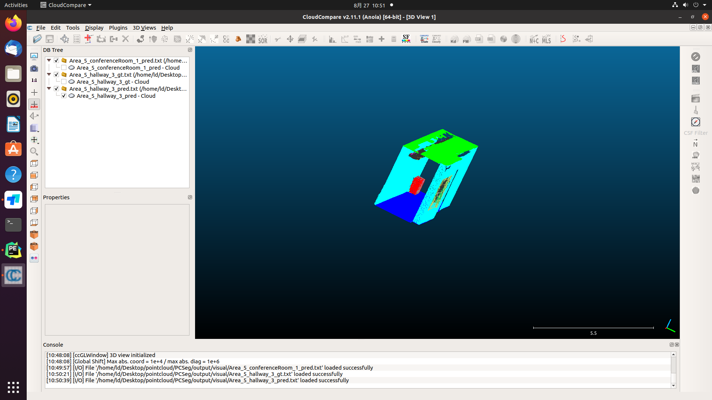

An pointcloud segmentation tools implemented in paddlepaddle.


## evaluate
|  Model   |  miou  |   OA   |
|:--------:|:------:|:------:|
| Pointnet | 43.99% | 80.25% |

## how to use
Download 3D indoor parsing dataset (**S3DIS**) [here](http://buildingparser.stanford.edu/dataset.html)  and save in `data/s3dis/Stanford3dDataset_v1.2_Aligned_Version/`.
Run the above command and preprocess dataset:
```
python data_prepare/collect_indoor3d_data.py
```

train command:
```commandline
python tools/train.py --config configs/pointnet/pointnet_4096_32e.yml --use_vdl --log_iter 10 --save_interval 1 --save_dir output  --num_workers 6
```

val command:
```commandline
python tools/val.py --config configs/pointnet/pointnet_4096_32e.yml --model_path output/iter_95232/model.pdparams --num_votes 3 --num_workers 6
```

## visual
if you set do_eval when training, "output/visual" fold will save evaluate prediction results. Your can visual it by comparecloud.


## Acknowledge
We have borrowed a plenty of code from [PaddleSeg](https://github.com/PaddlePaddle/PaddleSeg) and [Pointnet_Pointnet2_pytorch](https://github.com/yanx27/Pointnet_Pointnet2_pytorch), and we would like to express our gratitude to their open source community.
